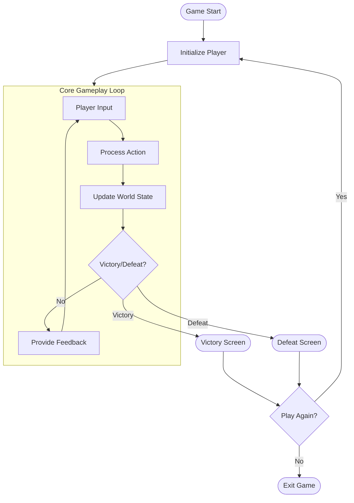
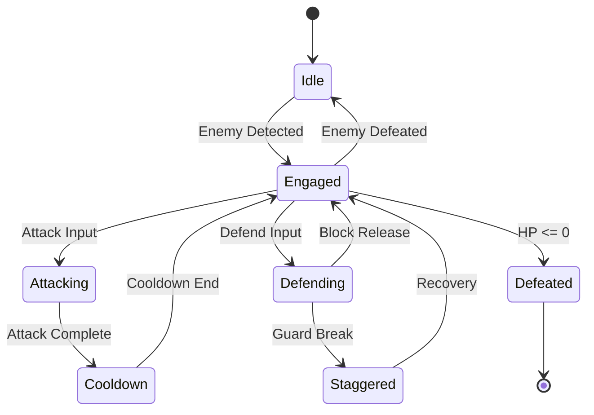
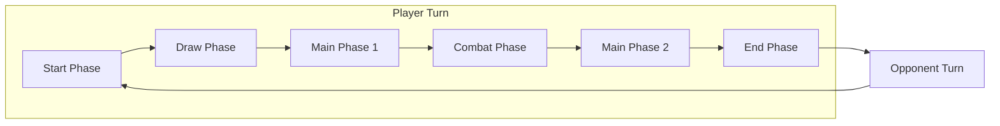
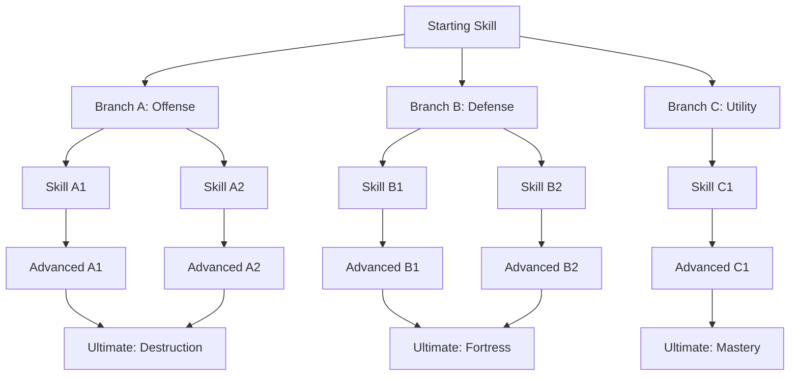
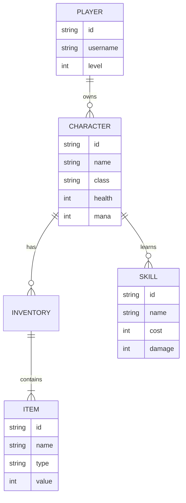
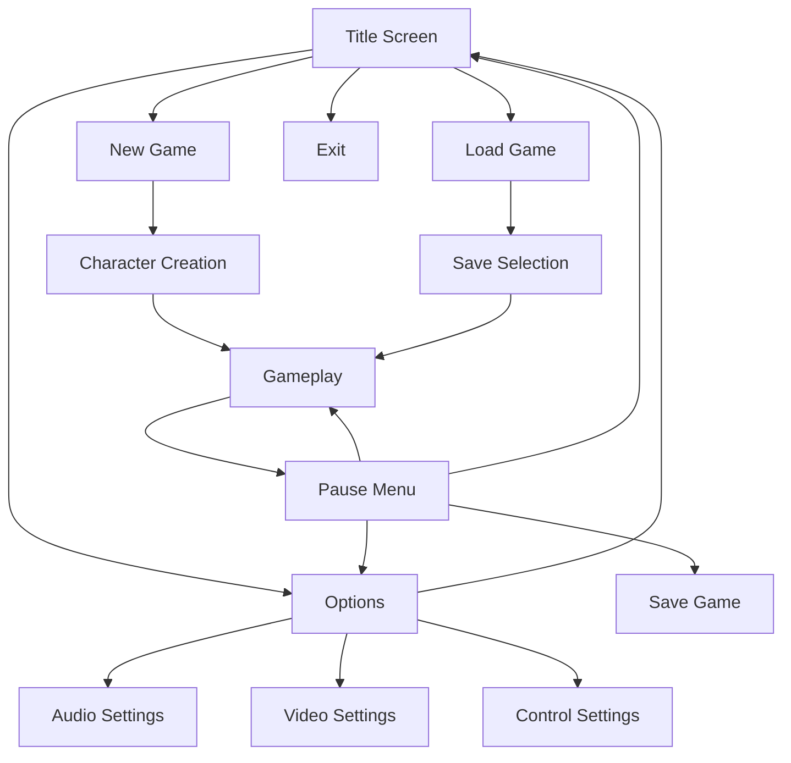
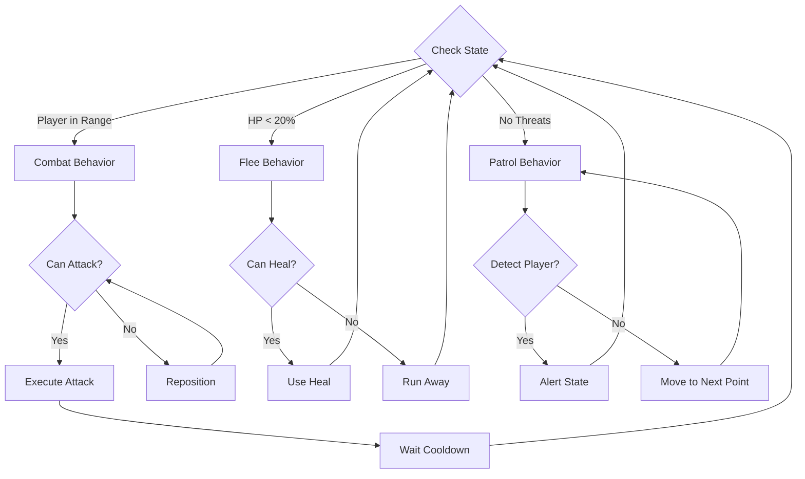
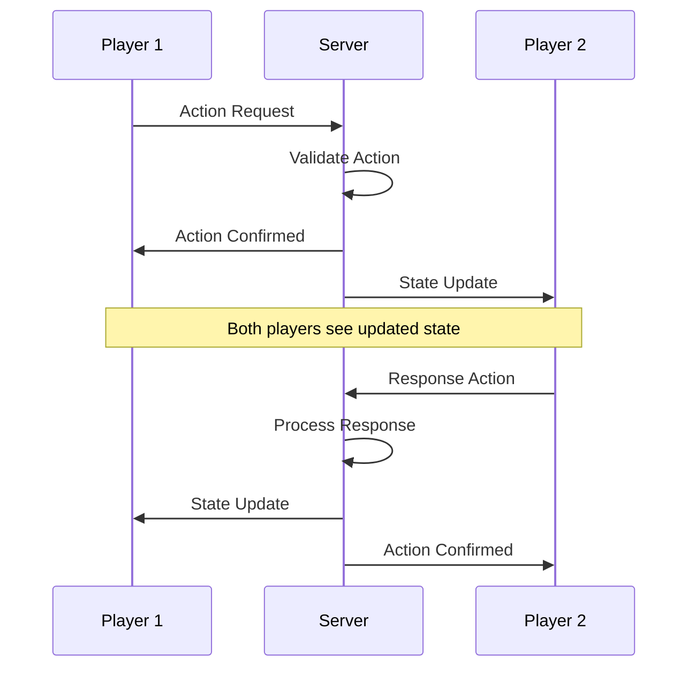
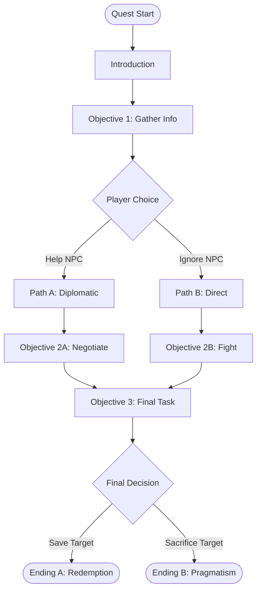
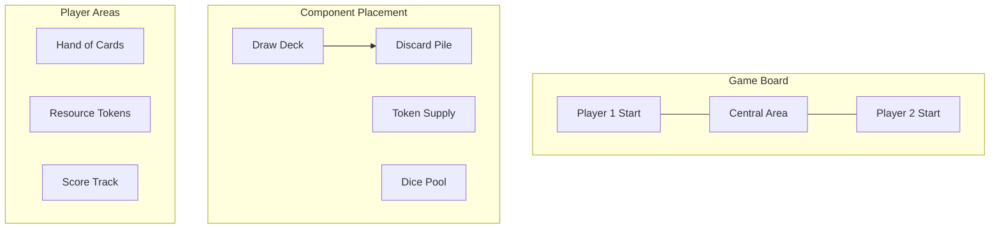

# Supplement Document Templates

This file contains templates for all supplement document types that can be generated by the Supplement Writer Agent.

---

## Template Index

1. [Stats Tables](#stats-tables)
2. [Item Catalogs](#item-catalogs)
3. [Ability/Skill Lists](#abilityskill-lists)
4. [Character Sheets](#character-sheets)
5. [Lore Bible](#lore-bible)
6. [Location Guide](#location-guide)
7. [Faction Dossiers](#faction-dossiers)
8. [Quest/Mission Catalog](#questmission-catalog)
9. [Achievement List](#achievement-list)
10. [Dialogue Samples](#dialogue-samples)
11. [System Flows](#system-flows)
12. [Data Schemas](#data-schemas)
13. [Balance Sheets](#balance-sheets)
14. [Component Specifications](#component-specifications-tabletop)
15. [Card Database](#card-database)
16. [Rules Quick Reference](#rules-quick-reference-tabletop)

---

## Stats Tables

### Basic Stats Table

```markdown
# [Subject] Stats

## Base Stats

| Entity | HP | ATK | DEF | SPD | Special |
|--------|----|----|-----|-----|---------|
| [Name] | [X] | [X] | [X] | [X] | [Ability] |

## Scaling Notes
[How stats scale with level/progression]
```

### Comparative Stats Table

```markdown
# [Category] Comparison

| [Entity] | Stat A | Stat B | Stat C | Best For |
|----------|--------|--------|--------|----------|
| Type 1 | High | Low | Med | [Use case] |
| Type 2 | Low | High | Med | [Use case] |
```

---

## Item Catalogs

### Weapon Catalog

```markdown
# Weapons

## [Weapon Category]

### [Weapon Name]
- **Damage**: [X-Y]
- **Speed**: [Fast/Normal/Slow]
- **Range**: [Melee/Short/Medium/Long]
- **Special**: [Unique effect]
- **Acquisition**: [How to get]
- **Cost**: [Price]

> *[Flavor description]*
```

### Consumable Catalog

```markdown
# Consumables

## [Category]

| Item | Effect | Duration | Stack | Cost | Source |
|------|--------|----------|-------|------|--------|
| [Name] | [What it does] | [Time] | [Max] | [Price] | [Where found] |
```

---

## Ability/Skill Lists

### Ability List

```markdown
# [Class/Type] Abilities

## Active Abilities

### [Ability Name]
- **Unlock**: [When available]
- **Cost**: [Resource cost]
- **Cooldown**: [Time]
- **Effect**: [What it does]
- **Scaling**: [How it improves]

## Passive Abilities

### [Passive Name]
- **Unlock**: [When available]
- **Effect**: [Constant benefit]
- **Stacks With**: [Compatible abilities]
```

### Skill Tree

```markdown
# [Tree Name] Skill Tree

```
[Root Skill]
    |
    +-- [Branch A Skill 1]
    |       |
    |       +-- [Branch A Skill 2]
    |
    +-- [Branch B Skill 1]
            |
            +-- [Branch B Skill 2]
```

## Skill Details
[Individual skill descriptions]
```

---

## Character Sheets

### Player Character Sheet

```markdown
# [Character Name]

## Identity
- **Full Name**:
- **Title/Alias**:
- **Age**:
- **Background**:

## Stats
| Stat | Base | Max |
|------|------|-----|
| [Stat] | [X] | [Y] |

## Abilities
- [Ability 1]
- [Ability 2]

## Equipment
- Weapon:
- Armor:
- Accessory:

## Story Role
[Their function in the narrative]

## Gameplay Role
[Their function in gameplay]
```

### NPC Profile

```markdown
# [NPC Name]

## Basic Info
- **Location**: [Where found]
- **Role**: [Merchant/Quest Giver/etc.]
- **Disposition**: [Friendly/Neutral/Hostile]

## Interaction
- **Services**: [What they offer]
- **Dialogue Topics**: [What they talk about]
- **Related Quests**: [Connected content]

## Background
[Brief history]
```

---

## Lore Bible

### World History Entry

```markdown
# [Event/Era Name]

## Summary
[Overview paragraph]

## Timeline
- [Date]: [Event]
- [Date]: [Event]

## Key Figures
- [Name]: [Role]

## Legacy
[How this affects the present]

## Related
- [Link to related lore]
```

---

## Location Guide

### Location Entry

```markdown
# [Location Name]

## Overview
- **Type**: [City/Dungeon/Region/etc.]
- **Theme**: [Visual/gameplay theme]
- **Level Range**: [If applicable]

## Description
[Detailed description]

## Points of Interest
1. [POI Name]: [Description]
2. [POI Name]: [Description]

## NPCs
- [NPC]: [What they do]

## Encounters
- [Enemy types found here]

## Loot/Resources
- [What can be found here]

## Connected Areas
- North: [Location]
- South: [Location]
```

---

## Faction Dossiers

### Faction Entry

```markdown
# [Faction Name]

## Profile
- **Type**: [Government/Guild/Criminal/etc.]
- **Size**: [Small/Medium/Large]
- **Influence**: [Local/Regional/Global]

## Overview
[Description]

## History
[How they formed]

## Leadership
- **Leader**: [Name and description]
- **Structure**: [How organized]

## Goals
[What they want]

## Methods
[How they operate]

## Resources
[What they have access to]

## Allies & Enemies
- **Allies**: [Friendly factions]
- **Enemies**: [Opposing factions]

## Player Interaction
[How players can engage with this faction]
```

---

## Quest/Mission Catalog

### Quest Entry

```markdown
# [Quest Name]

## Basic Info
- **Type**: [Main/Side/Repeatable]
- **Giver**: [NPC name]
- **Location**: [Where it takes place]
- **Level**: [Recommended level]

## Overview
[Brief description]

## Objectives
1. [Objective 1]
2. [Objective 2]
3. [Objective 3]

## Rewards
- XP: [Amount]
- Currency: [Amount]
- Items: [List]
- Other: [Reputation, unlocks, etc.]

## Walkthrough
[Step-by-step guide]

## Choices & Outcomes
[If quest has branching]
```

---

## Achievement List

### Achievement Entry

```markdown
# Achievements

## [Category]

### [Achievement Name]
- **Icon**: [Description for artist]
- **Description**: "[In-game text]"
- **Requirement**: [How to unlock]
- **Reward**: [What you get]
- **Hidden**: [Yes/No]
- **Difficulty**: [Easy/Medium/Hard]
```

---

## Dialogue Samples

### Character Voice Guide

```markdown
# [Character Name] Dialogue Guide

## Voice Profile
- **Tone**: [Formal/Casual/Aggressive/etc.]
- **Vocabulary**: [Simple/Complex/Technical/etc.]
- **Quirks**: [Speech patterns, catchphrases]

## Sample Lines

### Greetings
> "[Greeting 1]"
> "[Greeting 2]"

### Combat
> "[Battle cry]"
> "[Taking damage]"
> "[Victory]"

### Story Moments
> "[Key story line 1]"
> "[Key story line 2]"

## Words/Phrases They Use
- [Word/phrase]: [When they use it]

## Words/Phrases They Avoid
- [Word/phrase]: [Why they wouldn't say this]
```

---

## System Flows

### State Machine

```markdown
# [System] State Machine

## States

### [State 1]
- Entry: [Condition]
- Exit: [Condition]
- Actions: [What happens]

## Transitions

| From | To | Trigger |
|------|----|---------|
| [State A] | [State B] | [Event] |

## Diagram
```
[State A] --(event)--> [State B]
    ^                      |
    |                      v
[State D] <--(event)-- [State C]
```
```

---

## Data Schemas

### Entity Schema

```markdown
# [Entity] Data Schema

## Fields

| Field | Type | Required | Default | Description |
|-------|------|----------|---------|-------------|
| id | string | Yes | - | Unique identifier |
| name | string | Yes | - | Display name |
| [field] | [type] | [Y/N] | [default] | [description] |

## Relationships
- Parent: [Entity type]
- Children: [Entity types]
- References: [Other entities]

## Example
```json
{
  "id": "item_001",
  "name": "Example Item",
  ...
}
```
```

---

## Balance Sheets

### Economy Balance

```markdown
# Economy Balance

## Currency Flow

### Income Sources
| Source | Amount | Frequency | Notes |
|--------|--------|-----------|-------|
| [Source] | [X] | [Per hour/day/etc.] | [Conditions] |

### Expenditures
| Sink | Cost | Frequency | Purpose |
|------|------|-----------|---------|
| [Sink] | [X] | [How often] | [Why players spend] |

## Balance Targets
- Early game income: [X/hour]
- Mid game income: [X/hour]
- Late game income: [X/hour]

## Inflation Prevention
[Mechanisms to control economy]
```

---

## Component Specifications (Tabletop)

### Component List

```markdown
# Component Specifications

## Summary
- **Box Size**: [Dimensions]
- **Total Components**: [Count]
- **Estimated Weight**: [Weight]

## Cards

| Card Type | Count | Size | Finish |
|-----------|-------|------|--------|
| [Type] | [X] | [Standard/Mini/Tarot] | [Matte/Gloss] |

## Tokens/Markers

| Token | Count | Size | Material | Color |
|-------|-------|------|----------|-------|
| [Type] | [X] | [Diameter] | [Cardboard/Wood/Plastic] | [Color] |

## Board

- **Size**: [Folded/Unfolded dimensions]
- **Folds**: [Bi-fold/Tri-fold/Quad-fold]
- **Material**: [Thickness, finish]

## Other Components
[Dice, minis, standees, etc.]

## Insert Design
[Box organization]
```

---

## Card Database

### Card Entry

```markdown
# [Card Set/Type]

## [Card Name]

| Attribute | Value |
|-----------|-------|
| **Set** | [Set name] |
| **Type** | [Card type] |
| **Rarity** | [Rarity] |
| **Cost** | [Resource cost] |

**Effect Text**:
> [Card effect as written on card]

**Flavor Text**:
> *[Flavor text]*

**Art Description**:
[Description for artist]

**Design Notes**:
[Why this card exists, balance considerations]
```

---

## Rules Quick Reference (Tabletop)

### Quick Reference Card

```markdown
# Quick Reference

## Turn Structure
1. [Phase 1]: [What to do]
2. [Phase 2]: [What to do]
3. [Phase 3]: [What to do]

## Key Actions
- **[Action]**: [Brief description]
- **[Action]**: [Brief description]

## Important Rules
- [Rule 1]
- [Rule 2]

## Winning
[How to win]

## Icons
- [Icon]: [Meaning]
- [Icon]: [Meaning]
```

---

## System Diagrams (Mermaid)

Mermaid diagrams provide visual representations of game systems, flows, and relationships. These render in most markdown viewers and documentation platforms.

### When to Use Mermaid Diagrams

Generate Mermaid diagrams when the game has:
- Complex state transitions (combat, menus, game modes)
- Multi-step gameplay loops
- Branching progression systems
- Entity relationships that benefit from visualization
- Turn structures or phase sequences
- Decision trees or AI behavior flows

### Gameplay Loop Flowchart

```markdown
# Gameplay Loop Diagram

## Core Loop



## Loop Description
[Explanation of each phase and what happens during it]
```

### Combat State Diagram

```markdown
# Combat System States

## State Machine



## State Descriptions

### Idle
- **Entry**: No enemies in range
- **Behavior**: Normal movement, can interact with environment
- **Exit**: Enemy enters detection range

### Engaged
- **Entry**: Enemy detected or combat initiated
- **Behavior**: Combat movement, abilities available
- **Exit**: All enemies defeated or player defeated

[Continue for each state...]
```

### Turn/Phase Sequence Diagram

```markdown
# Turn Structure Diagram

## Turn Phases



## Phase Details

### Start Phase
**Actions Available**: [List]
**Triggers**: [What happens automatically]

[Continue for each phase...]
```

### Progression Tree Diagram

```markdown
# Skill/Tech Tree Diagram

## [Tree Name]



## Skill Requirements
| Skill | Prerequisites | Cost |
|-------|---------------|------|
| [Skill] | [Required skills] | [Points] |
```

### Entity Relationship Diagram

```markdown
# Game Entity Relationships

## Entity Diagram



## Relationship Details
[Explanation of how entities interact]
```

### Menu/UI Flow Diagram

```markdown
# UI Navigation Flow

## Menu Structure



## Navigation Notes
[Details about transitions and states]
```

### AI Behavior Decision Tree

```markdown
# AI Behavior Tree

## [Enemy/NPC Name] Behavior



## Behavior Notes
[Detailed explanation of AI decision making]
```

### Multiplayer Interaction Sequence

```markdown
# Multiplayer Sequence Diagram

## [Interaction Name]



## Sequence Notes
[Explanation of timing and synchronization]
```

### Quest/Story Branch Diagram

```markdown
# Quest Flow Diagram

## [Quest Name]



## Branch Outcomes
| Choice | Outcome | Rewards | Consequences |
|--------|---------|---------|--------------|
| [Choice] | [What happens] | [Rewards] | [Long-term effects] |
```

### Board Game Setup Diagram (Tabletop)

```markdown
# Board Setup Diagram

## Initial Setup



## Setup Steps
1. [Step 1]
2. [Step 2]
3. [Step 3]
```

---

## Mermaid Diagram Guidelines

When generating Mermaid diagrams:

1. **Choose the Right Type**:
   - `flowchart`: For processes, loops, decision trees
   - `stateDiagram-v2`: For state machines with transitions
   - `sequenceDiagram`: For interactions between entities over time
   - `erDiagram`: For data/entity relationships
   - `classDiagram`: For class hierarchies (use sparingly)

2. **Keep It Readable**:
   - Limit nodes to 15-20 per diagram
   - Use subgraphs to group related elements
   - Use clear, concise labels
   - Break complex systems into multiple diagrams

3. **Use Consistent Styling**:
   - `([text])` for start/end nodes
   - `[text]` for process nodes
   - `{text}` for decision nodes
   - `(text)` for rounded nodes

4. **Include Context**:
   - Always accompany diagrams with explanatory text
   - Add tables for detailed information
   - Reference related GDD sections

5. **Test Rendering**:
   - Mermaid syntax must be valid
   - Avoid special characters in labels
   - Use quotes for labels with spaces if needed

---

## Usage Notes

When generating supplements:
1. Select the appropriate template for the supplement type
2. Adapt structure to the specific game's needs
3. Maintain consistency with GDD terminology
4. Fill in all sections completely
5. Remove template instructions from final output
6. For Mermaid diagrams, ensure syntax is valid and renders correctly
